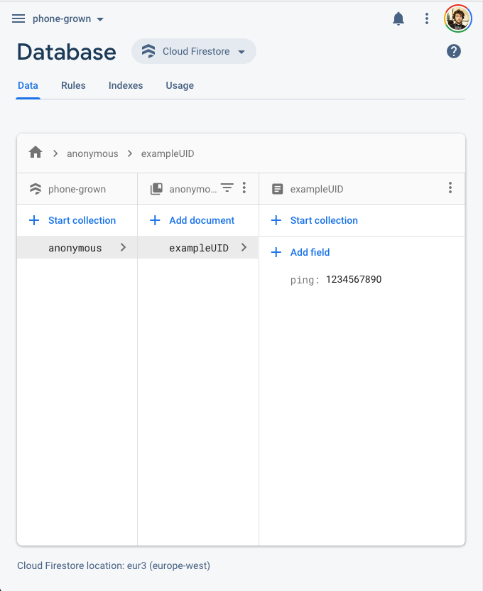

# Google App Script (GAS)
Google App Script is a Javascript based language that allow the creation and deployment of scripts within the Google ecosystem. More interestingly, you can create document-bound scripts, which are embedded to a specific document (Google Doc, Sheet, Site, etc). In this project, we use this so that when someone makes a copy of the Google Sheet, this script is copied with it. Then, the owners can deploy the code themselves. This approach is beneficial because:
1. this provides full transparency and control over what the script does,
1. the document-bound script has more access and control over the document,
1. scalability (hosting and quotas) is no problem.

## Content
The [`appscript.json`](appscript.json) file contains the rules needed for this project to work. It sets the visibility of the app (if deployed) to public and to run as the user themselves, in order to write and read from the Google Sheet. It also states any authentication scopes the code needs in order to work, these currently include:
1. Spreadsheets - write and read from Google Spreadsheets,
1. External Requests - perform and receive HTTPS / REST requests, and
1. UI - add menu buttons to the UI and create popups

### The code
The Code, split into 4 files, is bound to the Google Sheet. It is extensively commented to explain each function, but here is a rundown of each of the files. The Google App Script compiler will consider all files as one big file - so the separation is solely to make it more manageable.

#### [Main Code.gs](Main%20Code.gs)
This file contains the primary methods used. It listens for changed in the spreadsheet (`somethingChanged()`), and acts accordingly. For example, when new data came in, it checks whether a rule was triggered (`activateRule()`), updates the instructions accordingly (`addPhoneInstruction()`, `storeTodos()` and `retrieveTodos()`). The _Home_ tab of Google Sheet also provides four buttons: to set up the sheet (`setup()`), to clear the phone of colours and instructions (`clearPhone()`, `storeClearPhone()` and `retrieveClearPhone()`), and to add a new background tab (`addBackground()`) or another rule (`addRule()`). On a background tab, a test button allows a background to be displayed for 30 seconds on the phone (`testBackground()`) and another helper methods gets the set sleeptimes for the phone to _not_ display any colours (`getSleepTimes()`). The `onOpen()` method only ensure that the _Home_ tab is displayed first when opening the Google Sheet.

Lastly, the standard `doGet()` method provides the responses to HTTP requests from the phone. It checks if the GET request is appropriate (with certain parameters), and replies with any current instructions for the phone.

#### [Helpers.gs](Helpers.gs)
All methods in helpers help with small but repeatable and reusable tasks. These relate to reading and writing within the Google Sheet itself, such as moving data from one sheet to another (`prependRow()`), sorting the sheet alphabetically (`sortSheets()`), finding a particular sheet (`findSheets()`) or updating the system status on the Home sheet (`updatePhoneStatus()`). Other methods include clearing the background of an area in the sheet (`clearBackground()`) or calculating a duration based on user input (`calcDuration()`). Lastly, to prevent the `setup()` to install multiple identical listeners, the `deleteTrigger()` method clears all set listeners and the `about()` method opens a sidebar with additional information and help about this project.

#### [Database Code.gs](Database%20Code.gs)
The three methods in this file handle the communication with the [Firestore Database](#firestore-rules). When the 'Setup' button is pressed, and the `setup()` method runs, a new anonymous user is created in the database (`newAnonymousUser()`) by authenticating with Google's [Identity Platform](https://cloud.google.com/identity-platform/). It receives an refresh token that provides access to the Firestore database for one hour, and is refreshed when outdated (`refreshDatabaseToken()`). Lastly, any time a new instruction is ready for the phone, the timestamp on the database is updated (`pingDatabase()`), which alerts the phone to retreive new data from via HTTPS (`doGet()`).


#### [Variables.gs](Variables.gs)
A last file stores all fixed variables, such as the location of instructions or 'sleep time' settings in the Google Sheet. If the layout of the Google Sheet changes (e.g. tab names or added rows) these values need to be adjusted accordingly. Note that some, infrequently changing, variables are stored in the scripts [PropertyService](https://developers.google.com/apps-script/reference/properties/properties-service). Most frequently changing variables, such as instructions, are stored in the Google Sheet itself. After testing various approaches, its reading and writing speed outperformed the others, and additionally avoided issues with volatile access.

# Firestore Rules
Below is a copy of the security rules used in the Google Firestore database in this project. This merely shows the strictness of the database, and is copied here for reference and transparency.

In its current state, anyone can read any document in the `anonymous` collection. No authentication is required, which was chosen in order to simplify the user experience. In essence, no sensitive data is (or can be) stored in this document, so it should be relatively safe. This approach might be altered if vulnerabilities are determined.


```js
rules_version = '2';
service cloud.firestore {
  match /databases/{database}/documents {

    // only the 'anonymous' collection can be accessed and edited
    match /anonymous/{userId} {

    	// a user can only create or update document when:
      // 1: it is an authenticated request
      // 2: the document bears the same name as the authenticated user
      // 3: the document only contains one field
      // 4: that field is named 'ping' and is an integer
    	allow update, create : if request.auth != null
      	&& request.auth.uid == userId
      	&& request.resource.data.size() == 1
        && request.resource.data.ping is int;

      // deleting a document is only possible when:
      // 1: it is an authenticated request
      // 2: the document bears the same name as the authenticated user
      allow delete : if request.auth != null
      	&& request.auth.uid == userId;

			// reading data is only possible through a get command,
      // lists (getting multiple documents) is not allowed.
      allow list: if false;
      allow get: if true;
    }
  }
}
```

## Result
The resulting database looks as follows, with more documents being added based on new anonymous users.

